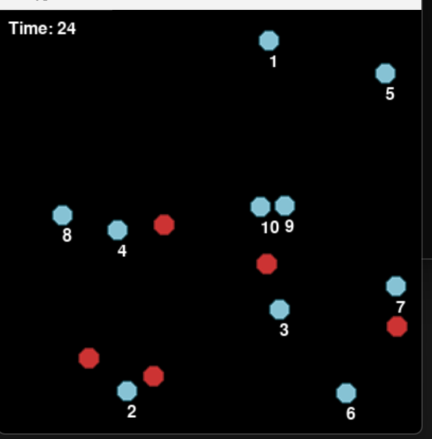

#  Dot Connect Game

A quick reflex-based game built using **Pygame Zero**. Connect all the correct dots in order within 30 seconds—watch out for red decoys!

##  Gameplay

* 15 dots appear randomly on the screen.
* 10 are green (clickable in order), and 5 are red (decoys).
* Click the green dots in the correct numerical order.
* Avoid clicking red dots or clicking out of order.
* You have **30 seconds** to connect them all.
* Win by connecting all green dots correctly!
* Lose if you run out of time or make a wrong click.

##  Screenshot



##  Requirements

* Python 3.7+
* Pygame Zero

Install the dependencies using pip:

```bash
pip install pgzero
```

##  How to Run

Save the code as `game.py` and run:

```bash
pgzrun game.py
```

Make sure your working directory includes the following image files:

* `dot.png` (green or neutral dot)
* `red-dot.png` (red decoy dot)

These should be in the same folder as your script or inside an `images/` directory as per Pygame Zero’s asset loading system.


## 📘 Notes

* The game uses `time` for countdowns and mouse click handling for interactions.
* The random dot placement and shuffling ensures a new experience each time.
